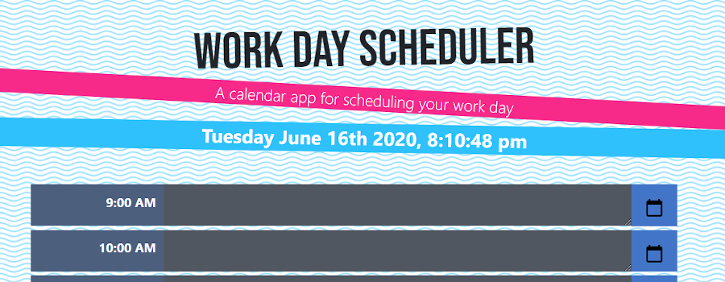

# Work Day Scheduler

You can view the deployed application here: https://johnfranke.github.io/Workday-Scheduler/

## Preview



## Description

This is a work day scheduler. This app allows a user to input text into a certain hour of the day.  The application displays timeblocks for standard business hours (9 a.m. to 5 p.m.). Once text is entered, the user will click the 'save' button and their input will be stored in 'localStorage', allowing the text to persist when the application is refreshed. If the user wants to delete an event, they can by deleting their input and clicking the 'save' button.

The current day and time is displayed near the top of the calendar. Also, each timeblock is color coded to indicate whether it is in a past, present, or future hour.

## User Story

```
AS AN employee with a busy schedule
I WANT to add important events to a daily planner
SO THAT I can manage my time effectively
```
```
GIVEN I am using a daily planner to create a schedule
WHEN I open the planner
THEN the current day is displayed at the top of the calendar
WHEN I scroll down
THEN I am presented with timeblocks for standard business hours
WHEN I view the timeblocks for that day
THEN each timeblock is color coded to indicate whether it is in the past, present, or future
WHEN I click into a timeblock
THEN I can enter an event
WHEN I click the save button for that timeblock
THEN the text for that event is saved in local storage
WHEN I refresh the page
THEN the saved events persist
```

## Technologies Used

VS Code

HTML

CSS

JavaScript

JQuery

Moment.js

localStorage

Bootstrap


